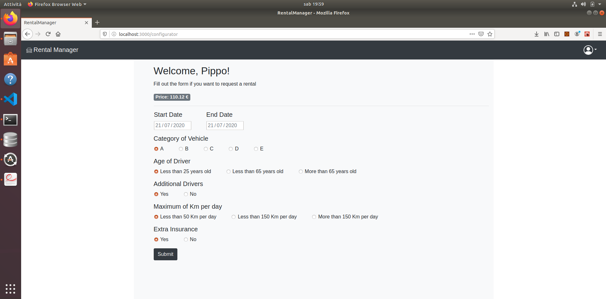

# Esame #1: "Noleggio auto"
## Student: s280123 CINELLI ERMETE 

## React client application routes

- Route `/home`: visualizzazione di tutti i veicoli presenti con la possibilità di filtrarli per marche e categorie
- Route `/login`: pagina per poter effettuare login
- Route `/configurator`: pagina per poter richiedere un nuovo noleggio (è possibile accedervi solo se loggati)
- Route `/payment`: pagina nella quale si viene reindirizzati dopo aver accettato la proposta di noleggio offerta, essa permette di poter procedere al pagamento
- Route `/reservations`: pagina nella quale è possibile accedere allo storico dei noleggi effettuati e a quelli futuri con la possibilità di annullarli

## REST API server

- POST `/login`
  - request body: 
    - username
    - password
  - response body: oggetto che rappresenta l'utente

- GET `/csrf-token`
  - request body: none
  - response body: csrfToken

- POST `/logout`
  - request body: none 
  - response body: none

- GET `/api/vehicles`
  - request body: none
  - response body: lista dei veicoli

- GET `/api/vehicles/:category/:brand`
  - request query: 
    - fun se definito e uguale a "get_number", restituisce la dimensione della lista
  - request params
    - category definisce il filtro per categoria, se uguale a "all" è disattivo
    - brand definisce il filtro per brand, se uguale a "all" è disattivo
  - response body: lista dei veicoli filtrati in base a brand e categoria, oppure la dimensione di tale lista 

- GET `/api/brands`
  - request body: none
  - response body: lista dei brand delle auto disponbili

- GET `/api/vehicles/:category/:brand/free`
  - request query: 
    - fun se definito e uguale a "get_number", restituisce la dimensione della lista
    - start_date indica la data iniziale per la quale si deve controllare la disponibilità del veicolo
    - end_date indica la data finale per la quale si deve controllare la disponibilità del veicolo
  - request params
    - category definisce il filtro per categoria, se uguale a "all" è disattivo
    - brand definisce il filtro per brand, se uguale a "all" è disattivo
  - response body: restituisce la lista degli id dei veicoli disponibili in base ai criteri scelti, oppure la dimensione di tale lista e il primo elemento

- GET `/api/rentals/:email`
  - request query:
    - fun se definito e uguale a "get_number", restituisce la dimensione della lista dei noleggi passati
  - request params
    - email indica l'identificativo dell'utente del quale bisogna controllare i noleggi
  - response body: lista dei noleggi o numero dei noleggi passati

- POST `/api/rentals`
  - request body: insieme di parametri che definiscono un noleggio
  - response body: vero o falso in base all'esito dell'operazione

- DELETE `/api/rentals/:id`
  - request params: id indica l'id del noleggio da eliminare
  - response body: id del noleggio cancellato

- POST `/api/stub`
  - request body:
    - name indica il nome del proprietario della carta di credito
    - cc_number indica il numero della carta di credito
    - cvv indica il cvv della carta di credito
  - response body: vero o falso in base all'esito della validazione

## Server database

- Table `users` - contains email name password
- Table `vehicles` - contains id category brand model
- Table `rentals` - contains id id_vehicles user start_date end_date price category_of_vehicle age_of_driver additional_drivers avg_kmperday extra_insurance

## Main React Components

- `Login` (in `Login.js`): componente che permette di visualizzare un form che permette di effettuare l'operazione di login
- `TableOfVehicles` (in `ContentComponents.js`): componente che permette di visualizzare la lista dei veicoli
- `Configurator` (in `ContentComponents.js`): componente che permette di visualizzare un form attraverso il quale si può richiedere un noleggio
- `PaymentPage` (in `ContentComponents.js`): componente che permette di visualizzare un form attraverso il quale si può procedere al pagamento
- `Reservations` (in `ContentComponents.js`): componente che permette di visualizzare la lista dei noleggi, scegliendo tra quelli futuri e quelli passati
- `MyNavbar` (in `Bars.js`): componente che permette di visualizzare la navbar
- `Profile` (in `Bars.js`): componente che permette di visualizzare un bottone che apre un dropdown in cui sono presenti voci utili al fine di navigare nell'app
- `MyAsideBar` (in `Bars.js`): componente che permette di visualizzare l'asidebar
- `Categories` (in `Bars.js`): componente che permette di avere a disposizione una lista di categorie da selezionare al fine di filtrare la visualizzazione dei veicoli
- `Brands` (in `Bars.js`): componente che permette di avere a disposizione una lista di marche da selezionare al fine di filtrare la visualizzazione dei veicoli

(only _main_ components, minor ones may be skipped)

## Screenshot

## Test users

* pippo@mail.it, password  (frequent customer)
* pluto@mail.it, password
* paperino@mail.it, password
* minnie@mail.it, password
* ermete@mail.it, password (frequent customer)
